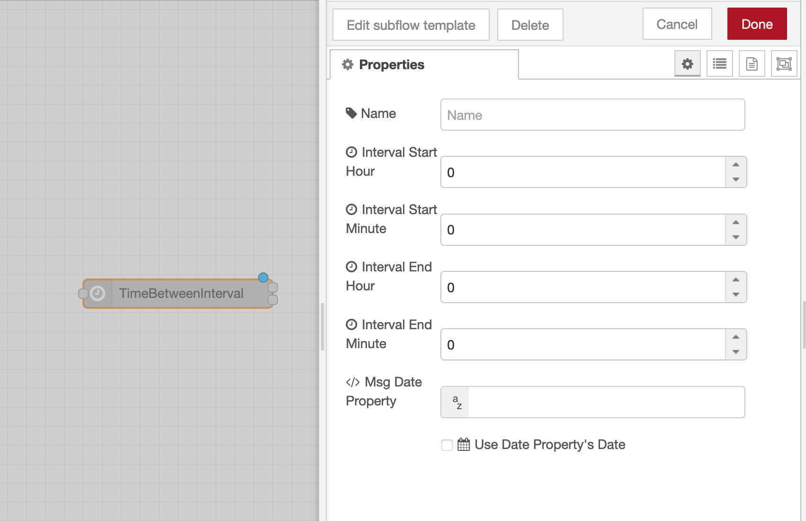

# node-red-subflows
My Personal Subflows That May Be Helpful

## [Time Between Interval](subflows/TimeBetweenInterval.json)
Check if a date is within a certain time interval.

If the `Interval Start Hour` and `Interval Start Minute` are both zero that means midnight today. If the `Interval End Hour` and `Interval End Minute` are both zero that means midnight tomorrow.

If the `Msg Date Property` is set, that property's value will be used as the comparison date, otherwise now is used.

Check `Use Date Property's Date` to use the Msg Date Property's date instead of today (just check that the time is within the interval and not necessarily that it's today).

