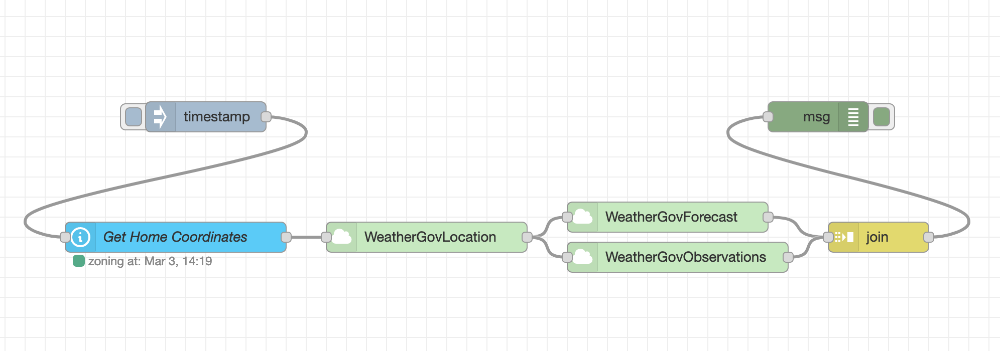

# node-red-subflows
My Personal Subflows That May Be Helpful

## [Time Between Interval](subflows/TimeBetweenInterval.json)
Check if a date is within a certain time interval.

If the `Interval Start Hour` and `Interval Start Minute` are both zero that means midnight today. If the `Interval End Hour` and `Interval End Minute` are both zero that means midnight tomorrow.

If the `Msg Date Property` is set, that property's value will be used as the comparison date, otherwise now is used.

Check `Use Date Property's Date` to use the Msg Date Property's date instead of today (just check that the time is within the interval and not necessarily that it's today).

## [Weather.gov Location](subflows/WeatherGovLocation.json)

This node takes your current lat/lon coordinates and gets the location information from weather.gov's API. This step doesn't get you much actionable information, but can be chained with other API calls to get the important forecast/condition data.

### Inputs
`Latitude` - the latitude for the forecast. Can be overridden by `msg.payload.latitude` or `msg.data.attributes.latitude` (for use with Home Assistant Zones).

`Longitude` - the longitude for the forecast. Can be overridden by `msg.payload.longitude` or `msg.data.attributes.longitude`.

### Output
`msg.payload` - The observation stations and other data for that location. Can be input directly into a forecast or observation node or both with a split/merge.

In this example, *WeatherGovForecast* has `Index` set to `0` and `Count` set to `2`. *WeatherGovObservations* has `Index` set to `1` and `Count` set to `2`. The `join` node is set to `automatic`.

## [Weather.gov Forecast](subflows/WeatherGovForecast.json)

This node takes the forecast URL from *WeatherGovLocation* and returns the forecast data.

### Inputs
`Forecast URL` - manually set the forecast URL to something like `https://api.weather.gov/gridpoints/[Station Code]/[Grid X],[Grid Y]`. Preferably you'll just chain this after a *WeatherGovLocation* node and not need to set this.

The following allow you to make multiple API calls and combine the results into a single message with a `join` node.

`Index` - If you're making calls to forecast and another endpoint, like observations, set to a unique index.

`Count` - If you're making calls to forecast and another endpoint, set to the total number of simultaneous calls.

### Output
`msg.payload` - The current forecast for the supplied grid. If using a join, the data will be at `msg.payload.forecast`.

## [Weather.gov Observations](subflows/WeatherGovObservation.json)

This node takes the observations URL from *WeatherGovLocation* and returns the current observation data.

### Inputs
`Observation URL` - manually set the observation station URL. Preferably, this will be chained after a *WeatherGovLocation* node and you won't need to set this.

The following allow you to make multiple API calls and combine the results into a single message with a `join` node.

`Index` - If you're making calls to observations and another endpoint, like forecast, set to a unique index.

`Count` - If you're making calls to observations and another endpoint, set to the total number of simultaneous calls.

### Output
`msg.payload` - The current observations for the supplied grid. If using a join, the data will be at `msg.payload.observations`.

## [Syncthing API](subflows/Syncthing.json)

Control a Syncthing instance via API. Currently just pause and resume is implemented.

<!--## 

-->